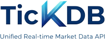

<div align="center">



*One connection for Forex, Precious Metals, Indices, US Stocks, HK Stocks, A-Shares, and Crypto*

[](https://tickdb.ai)
[](https://tickdb.ai)
[](#)
[](https://docs.tickdb.ai)
[](LICENSE)

**Languages:** [🇨🇳 简体中文](README.md) • [🇹🇼 繁體中文](README_tw.md) • [🇺🇸 English](README_en.md)

[📚 Online Docs](https://docs.tickdb.ai) • [🌐 Website](https://tickdb.ai)

</div>

---

## 🎯 What is TickDB?

TickDB is a **developer-first unified real-time market data API** that provides seamless access to multiple financial markets through a single connection.

Through **one connection**, you can seamlessly access real-time and historical market data from multiple financial markets. 

It is built for developers who **require reliable, low-latency, and production-grade** market data—without the overhead of managing multiple data sources, protocols, or vendors.

> TickDB provides real-time financial market data across forex, commodities, equities, indices, and cryptocurrencies.
> It supports tick-level trade data, order book depth, and candlestick (K-line) data via REST APIs and WebSocket streams,
> making it suitable for quantitative trading, real-time market dashboards, trading platforms, and market data analytics.

---

### ✨ Key Features

- **🔌 Unified Access** - One API for multiple markets and asset classes
- **⚡ Real-time Data** - WebSocket-based streaming with ~50ms end-to-end latency
- **🌍 Multi-Market Support** - Forex, Precious Metals, Indices, US Stocks, HK Stocks, A-Shares, Crypto
- **🛠️ Developer-Friendly** - RESTful API + WebSocket, rich examples, complete documentation

### 🏗️ Typical Use Cases

- **Quantitative Trading** - Real-time data source for algorithmic and strategy systems
- **Market Dashboards** - Real-time price displays, asset and portfolio monitoring
- **Trading Applications** - Build TradingView-like market interfaces and charting systems
- **Data Analytics & Backtesting** - Historical market analysis, strategy backtesting and research
- **Financial Services Integration** - Integration into existing trading platforms or financial infrastructure

---

## 🚀 Quick Start

### 1. Register and Get API Key

Visit [TickDB.ai](https://tickdb.ai) to register an account and get your API key.

#### 🔑 Authentication

All HTTP API requests require an API key in the request header:

```http
X-API-Key: YOUR_API_KEY
```

#### 🌐 Base URL

```
https://api.tickdb.ai
```

#### 📋 Core HTTP API Endpoints

| Endpoint | Method | Description |
|----------|--------|-------------|
| `/v1/market/kline` | GET | Historical K-line/candlestick data |
| `/v1/market/ticker` | GET | Real-time market data |
| `/v1/market/depth` | GET | Order book depth data |
| `/v1/market/trades` | GET | Recent trade history |

#### 🏪 Supported Markets

| Market Type | Symbol Format Example | Description |
|-------------|----------------------|-------------|
| Forex (FX) | `GBPUSD` | Major currency pairs (Base/Quote) |
| Precious Metals | `XAUUSD` | Precious metals vs USD (Commodity / USD) |
| US Stocks | `AAPL.US` | NYSE / NASDAQ listed stocks |
| Indices | `SPX` | Stock indices (e.g., S&P 500) |
| HK Stocks | `700.HK` | Hong Kong Stock Exchange securities |
| A-Shares | `600519.SH` | Shanghai / Shenzhen Exchange stocks |
| Cryptocurrency | `BTCUSDT` | Crypto asset trading pairs |

### 2. Get K-line Data

```bash
curl -H "X-API-Key: YOUR_API_KEY" \
     "https://api.tickdb.ai/v1/market/kline?symbol=700.HK&interval=1h&limit=24"
```

### 3. Get Real-time Ticker Data

```bash
curl -H "X-API-Key: YOUR_API_KEY" \
     "https://api.tickdb.ai/v1/market/ticker?symbols=AAPL.US,700.HK,BTCUSDT"
```

### 4. Get Order Book Depth Data

```bash
curl -H "X-API-Key: YOUR_API_KEY" \
     "https://api.tickdb.ai/v1/market/depth?symbol=AAPL.US&limit=10"
```

### 5. Get Trade Records Data

```bash
curl -H "X-API-Key: YOUR_API_KEY" \
     "https://api.tickdb.ai/v1/market/trades?symbols=AAPL.US&limit=20"
```

### 6. Query Available Trading Symbols

```bash
curl -H "X-API-Key: YOUR_API_KEY" \
     "https://api.tickdb.ai/v1/symbols/available?market=HK&limit=10"
```

### 7. Subscribe to Real-time Data via WebSocket

#### Supported Channels

- `ticker` - Real-time price updates
- `depth` - Order book changes
- `trade` - Real-time trade executions

```javascript
const ws = new WebSocket('ws://api.tickdb.ai/v1/realtime?api_key=YOUR_API_KEY');

ws.onopen = () => {
    // Subscribe to real-time prices
    ws.send(JSON.stringify({
        cmd: 'subscribe',
        data: {
            channel: 'ticker',
            symbols: ['BTCUSDT']
        }
    }));

    // Subscribe to real-time order book changes
    ws.send(JSON.stringify({
        cmd: 'subscribe',
        data: {
            channel: 'depth',
            symbols: ['BTCUSDT']
        }
    }));

    // Subscribe to real-time trade data
    ws.send(JSON.stringify({
        cmd: 'subscribe',
        data: {
            channel: 'trade',
            symbols: ['BTCUSDT']
        }
    }));
};
```

### 📚 Online Documentation (Recommended)

For complete API reference, parameter descriptions, and directly runnable example requests, visit our online documentation:

- **Docs**: https://docs.tickdb.ai

---

## 🚀 Developer Experience

### Easy Integration
- **Free to Start** - No credit card required, get API key instantly
- **Complete Documentation** - Detailed API reference and code examples
- **Multi-language Support** - JavaScript, Python, and more examples
- **Support Channels** - Telegram community and email support

### Powerful Features
- **Unified Interface** - One API for multiple markets
- **Real-time Data** - WebSocket streaming with ~10-50ms latency
- **Historical Data** - Complete K-line and trade history
- **High Availability** - 99.9% service uptime guarantee

### Getting Started
1. **Sign Up** - Visit [TickDB.ai](https://tickdb.ai)
2. **Get API Key** - Generate key in dashboard
3. **Run Examples** - Use our code samples to test quickly
4. **Build Apps** - Integrate into your projects

[Get Started Now →](https://tickdb.ai)

---

## 🤝 Community & Support

- **GitHub Issues** - [Report bugs or request features](https://github.com/tickdb/tickdb-unified-realtime-marketdata-api/issues)
- **Technical Support** - [Telegram](https://t.me/TickDB_Support)
- **Email** - [support@tickdb.ai](mailto:support@tickdb.ai)
- **Documentation** - [docs.tickdb.ai](https://docs.tickdb.ai)

---

## 📄 License

This documentation is licensed under the [MIT License](LICENSE).

</div>