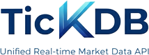

<div align="center">



*一個連接，覆蓋外匯、貴金屬、指數、美股、港股、A股、加密貨幣*

[](https://tickdb.ai)
[](https://tickdb.ai)
[](#)
[](https://docs.tickdb.ai)
[](LICENSE)

**語言版本:** [🇺🇸 English](README.md) • [🇨🇳 中文](README_zh.md) • [🇹🇼 繁體中文](README_tw.md)

[📚 在線文檔](https://docs.tickdb.ai) • [🌐 官網](https://tickdb.ai)

</div>

---

## 🎯 什麼是 TickDB？

TickDB 是一個**面向開發者的統一實時行情數據 API** 服務。

通過 **一次接入（one connection）**，即可無縫訪問多個金融市場的實時與歷史行情數據。

TickDB 專為需要**可靠、低延遲、可長期依賴**行情數據的開發者而構建，

幫助你**避免管理多個數據源、協議和供應商的複雜性**，專注於業務和策略本身。

> TickDB 提供覆蓋外匯、貴金屬、股票、指數、加密貨幣等市場的實時金融行情數據服務，
> 支持 tick 級成交數據、盤口深度（order book）、K 線（candlestick）等多種行情形式，
> 可通過 REST API 與 WebSocket 接入，適用於量化交易、實時行情系統、交易平台與數據分析場景。

---

### ✨ 核心特性

- **🔌 統一接入** - 一套 API 覆蓋多個市場和資產類別
- **⚡ 實時數據** - 基於 WebSocket 的流式推送，端到端延遲約 50ms
- **🌍 多市場支持** - 外匯、貴金屬、指數、美股、港股、A股、加密貨幣
- **🛠️ 開發者友好** - RESTful API + WebSocket，示例豐富、文檔完整

### 🏗️ 典型使用場景

- **量化交易** - 作為算法與策略系統的實時行情數據源
- **行情看板** - 實時價格展示、資產與投資組合監控
- **交易應用** - 構建類似 TradingView 的行情界面與圖表系統
- **數據分析與回測** - 歷史行情分析、策略回測與研究
- **金融服務集成** - 集成到現有交易平台或金融基礎設施中

---

## 🚀 快速開始

### 1. 註冊並獲取 API 密鑰

訪問 [TickDB.ai](https://tickdb.ai) 註冊賬戶，即可獲取 API 密鑰。

#### 🔑 身份認證

所有 HTTP API 請求都需要在請求頭中包含 API 密鑰：

```http
X-API-Key: YOUR_API_KEY
```

#### 🌐 基礎 URL

```
https://api.tickdb.ai
```

#### 📋 HTTP API 核心接口

| 接口 | 方法 | 描述 |
|------|------|------|
| `/v1/market/kline` | GET | 歷史 K 線/蠟燭圖數據 |
| `/v1/market/ticker` | GET | 實時行情數據 |
| `/v1/market/depth` | GET | 訂單簿深度數據 |
| `/v1/market/trades` | GET | 最近交易歷史 |

#### 🏪 支持的市場

| 市場類型 | Symbol 格式示例 | 說明 |
|---------|----------------|------|
| 外匯（FX） | `GBPUSD` | 主要貨幣對（Base/Quote） |
| 貴金屬 | `XAUUSD` | 貴金屬對美元（Commodity / USD） |
| 美股 | `AAPL.US` | NYSE / NASDAQ 上市股票 |
| 指數 | `SPX` | 股票指數（如標準普爾 500） |
| 港股 | `700.HK` | 港交所上市證券 |
| A 股 | `600519.SH` | 上海 / 深圳交易所股票 |
| 加密貨幣 | `BTCUSDT` | 加密資產交易對 |

### 2. 獲取 K 線數據

```bash
curl -H "X-API-Key: YOUR_API_KEY" \
     "https://api.tickdb.ai/v1/market/kline?symbol=700.HK&interval=1h&limit=24"
```

### 3. 獲取實時行情（ticker）數據

```bash
curl -H "X-API-Key: YOUR_API_KEY" \
     "https://api.tickdb.ai/v1/market/ticker?symbols=AAPL.US,700.HK,BTCUSDT"
```

### 4. 獲取盤口深度（depth）數據

```bash
curl -H "X-API-Key: YOUR_API_KEY" \
     "https://api.tickdb.ai/v1/market/depth?symbol=AAPL.US&limit=10"
```

### 5. 獲取成交記錄（trades）數據

```bash
curl -H "X-API-Key: YOUR_API_KEY" \
     "https://api.tickdb.ai/v1/market/trades?symbols=AAPL.US&limit=20"
```

### 6. 查詢可用交易品種

```bash
curl -H "X-API-Key: YOUR_API_KEY" \
     "https://api.tickdb.ai/v1/symbols/available?market=HK&limit=10"
```

### 7. 使用WebSocket 訂閱實時數據

#### 支持的頻道

- `ticker` - 實時價格更新
- `depth` - 訂單簿變化
- `trade` - 實時交易執行

```javascript
const ws = new WebSocket('ws://api.tickdb.ai/v1/realtime?api_key=YOUR_API_KEY');

ws.onopen = () => {
    // 訂閱實時價格
    ws.send(JSON.stringify({
        cmd: 'subscribe',
        data: {
            channel: 'ticker',
            symbols: ['BTCUSDT']
        }
    }));

    // 訂閱實時訂單簿變化
    ws.send(JSON.stringify({
        cmd: 'subscribe',
        data: {
            channel: 'depth',
            symbols: ['BTCUSDT']
        }
    }));

    // 訂閱實時成交數據
    ws.send(JSON.stringify({
        cmd: 'subscribe',
        data: {
            channel: 'trade',
            symbols: ['BTCUSDT']
        }
    }));
};
```

### 📚 在線文檔（推薦）

完整的 API 參考、參數說明、以及可直接運行的示例請求，請訪問在線文檔：

- **Docs**: https://docs.tickdb.ai

---

## 🚀 開發者體驗

### 簡單接入
- **免費開始** - 無需信用卡，立即獲取 API 密鑰
- **完整文檔** - 詳細的 API 參考和代碼示例
- **多語言支持** - JavaScript、Python 等示例代碼
- **支持渠道** - Telegram 社群與郵件支持

### 強大功能
- **統一接口** - 一套 API 覆蓋多個市場
- **實時數據** - WebSocket 流式傳輸，延遲約10-50ms
- **歷史數據** - 完整的 K 線和交易歷史
- **高可用性** - 99.9% 服務可用性保證

### 快速上手
1. **註冊賬戶** - 訪問 [TickDB.ai](https://tickdb.ai)
2. **獲取 API 密鑰** - 在控制面板生成密鑰
3. **運行示例** - 使用我們的代碼示例快速測試
4. **構建應用** - 集成到您的項目中

[立即開始 →](https://tickdb.ai)

---

## 🤝 社群和支持

- **GitHub Issues** - [報告錯誤或請求功能](https://github.com/tickdb/tickdb-unified-realtime-marketdata-api/issues)
- **技術支持** - [Telegram](https://t.me/TickDB_Support)
- **郵箱** - [support@tickdb.ai](mailto:support@tickdb.ai)
- **文檔** - [docs.tickdb.ai](https://docs.tickdb.ai)

---

## 📄 許可證

本文檔採用 [MIT 許可證](LICENSE)。

</div>